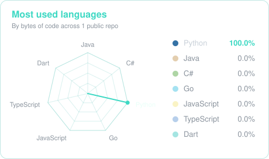
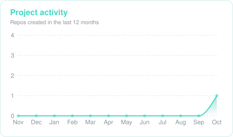

<!-- Animate banner -->

  

  

## About me

I am a **full stack developer** who loves turning data into clear, meaningful visualization. My main focus is the **backend**, where I feel most at home, but I also love building small web frontend projects to bring that data to life. 

Right now I am working on my **personal ecosystem that turns everday life into a role-playing game**. You log your activities and they shape your character's attributes, class and level over time, with monthly reports and a yearly chronicle of your progress on this game called life. It is made of several independent projects that also work together; a mobile app to log the activities during the day, a central API that stores everything, a collector that pulls data from services like GitHub, Strava or Steam, and many other functionalities. Each of this applications is built in a different (most optimal) language and can run on its own.

When it comes to writing code, I put special attention to do things properly. I follow **clean code** principles and good programming practices, and I like to structure my projects with **MVC** or **hexagonal architecture** so they stay easy to test, maintain and grow.

Outside of coding, I am drawn to anything that involves logic; videogames, chess and solving Rubik's cubes. But my real obsession is **automation** and **tracking day by day things**. Expenses, routies, sleep, the books I read... if it can be measured, I am probably measuring it haha. That's pretty much how the project above was born.

**Let's connect:** [LinkedIn](https://www.linkedin.com/in/biel-roca) · [Linktree](https://linktr.ee/bielrocafndz) · [Email](bielrocafndz@gmail.com)

## Technologies

  
    
  
    
  

## Charts

<!-- Generado por scripts/generate.mjs con Recharts: no edites entre los marcadores -->
<!-- CHARTS:START -->

<b>1</b> public repo · <b>0</b> ⭐ · <b>1</b> language · last push 4 days ago

<!-- CHARTS:END -->

## My contributions

<picture>
  <source media="(prefers-color-scheme: dark)" srcset="./charts/snake-dark.svg">
  
</picture>
